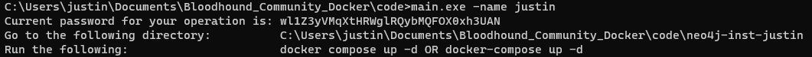
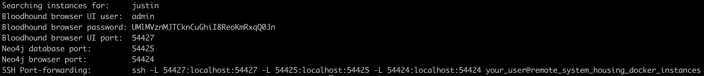

# Bloodhound Community Edition Multi-Deployment
---
### What
- Deploy multiple instances of the `Bloodhound Community Edition`
---
### Why
- Implementation of secure defaults for credentials
- Automatic allocation of container ports to forward
- Binding ports to local interfaces to ensure secure tunneling of clients
---
### Building
```sh
cd code
go build main.go
```
---
### Usage
```sh
main.exe --help
```
---
### Helper Scripts
- Located within `script_helpers`
    - Takes a single argument, meant to be the identifier for your `docker compose` deployment; e.g. `myname`
    - Parses appropriate metadata for items in the deployment, to include `docker` logs
    - Returns a convenient string to illustrate `SSH` port-forwarding instructions
---
### Example Outputs
#### Application


##### `script_helpers/bh_community_ports.py`
